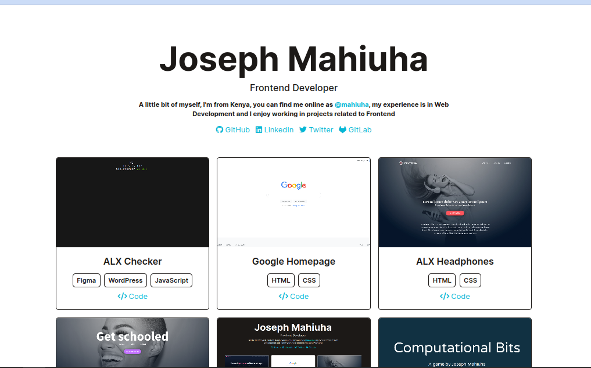

# My Portfolio
> Portfolio 2023

# Description:bulb:
Build my own minimal portfolio.

## Technologies & Tools:wrench:

> Porfolio homepage.

---

## Project Notes:books:
* Build with Vite, React, and Tailwindcss
* Minimal design
* Responsive
* Light and dark theme

---

## Author
* **Diego Monroy** (@diegozencode) - 

